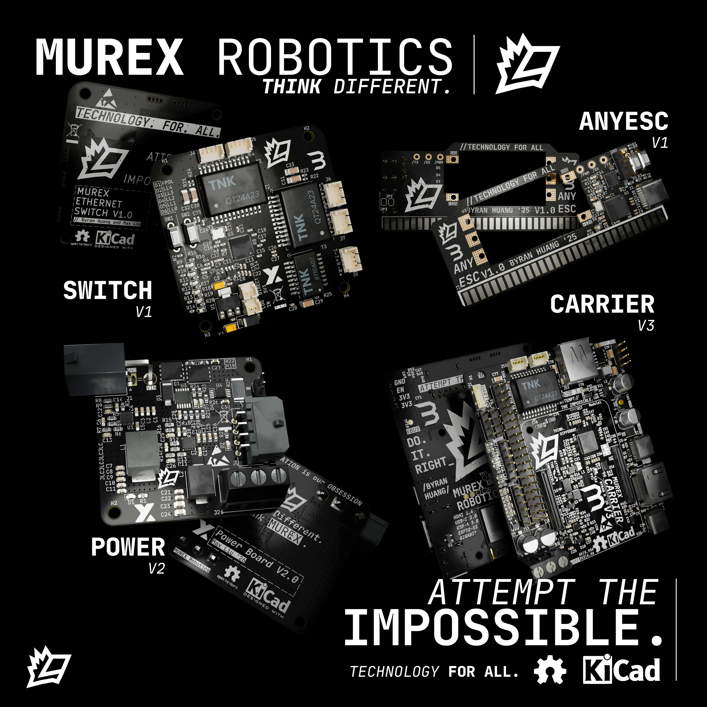

# MUREX Electrical 2024

Attempt the impossible.

## Welcome!

Welcome to MUREX Robotics Electrical. We are focused on pushing boundaries and making electronics/systems design more accessible to all.

> December 2023 progress poster

## Introduction

> *"I do not think there is any thrill that can go through the human heart like that felt by the inventor as he sees some creation of the brain unfolding to success"*
– [Nikola Tesla](https://en.wikipedia.org/wiki/Nikola_Tesla)

MUREX Robotics Electrical focuses on making everything highly integrated and custom. We make industrial/commercial level motion, power, communication, vision and wireless systems accessible to all. By making components fully custom, we can accomplish unprecedented levels of integration within MUREX robotics systems. By keeping COTS parts to a minimum, we vertically integrate all aspects of the robot, minimize space, and surprisingly, minimize cost. We don't do it the easy way. That's not what we believe in.

## Attempt the Impossible

Going to back our "mission statement"... (it's not really a mission statement, more a motivational quote)

> *Attempt the impossible*

What does this mean? Now that you have read through what MUREX Robotics Electrical (or *elec*) is all about and equipped with technical expertise, we can finally say what the true meaning is.

***Attempt the impossible***: We do it the best way possible. If pre-built parts or breakout boards don't cut it, we don't use it. If a processor isn't powerful enough, we don't use it. If a board isn't small enough, we make it smaller. No matter how difficult it may be to accomplish, we will follow through. No matter how hard it is. Things don't always go your way. No matter how hard you try to perfect your schematic, your PCB layout, your system integration, it still might not work out. Things are bound to go wrong, and it is up to *us* do it right. It's "impossible", a non-MUREX Robotics Electrical member might say. However, we accept it as the process. In the end, we will have achieved something others might have called "impossible". But the achievement only comes through endless, motivated attempts at the impossible.

> *Think Different*\
> *Unleash Innovation*\
> *Do It Right*

*Always attempting the impossible,*\
Members:

- Byran Huang '25 (@Hello9999901)
- Max Liu '26 (@xamuil2)
- Altan Unver '25 (@L0ad1n6)
- Crane Lee '27 (@Crane-Lee)
- Varit Asavathiratham '25 (@BaritoDespacito)
- Osbert Chang '27 (@Osbertchang)

Emeriti:

- Chaney Hollis '23 (@chaneyhollis)
